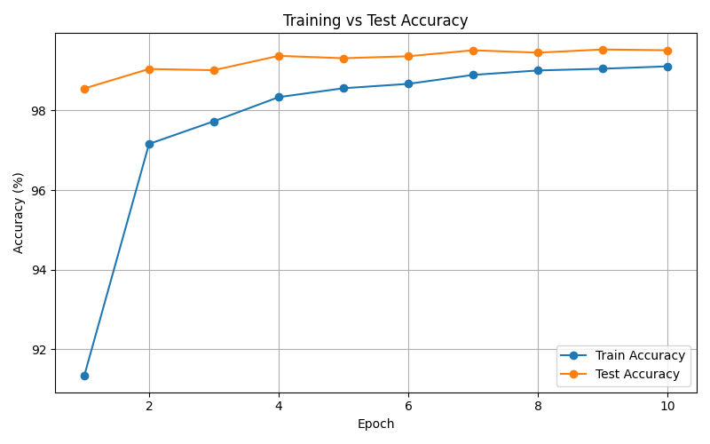

# MNIST Digit Classifier

A handwritten digit classifier built with PyTorch and a Convolutional Neural Network (CNN). Trained on the MNIST dataset, the model classifies grayscale images of digits (0-9) and achieves **>99% accuracy** on the test set.

---

## Demo

> Demo video showing the training curves and classification results in action.

https://drive.google.com/file/d/1zjWekewPG1htUuJxJoMiZ6uipwGUndzr/view?usp=sharing


**Sample Images**


**Training Curve**



**Classification Results**


---

## Results

| Metric | Value |
|---|---|
| Final Test Accuracy | ~ 99.5% |
| Epochs | 10 |
| Optimizer | Adam (lr=0.001) |
| Loss Function | CrossEntropyLoss |
| Training time (DELL G15 RTX ) | ~ 3 minutes |
---

## Model Architecture

The CNN has 3 convolutional blocks followed by 2 fully connected layers.

```
Input (1 × 28 × 28)
  --> Conv2d(1, 32, 3×3) --> ReLU --> MaxPool  -->  14×14
  --> Conv2d(32, 64, 3×3) --> ReLU --> MaxPool  -->  7×7
  --> Conv2d(64, 64, 3×3) --> ReLU  -->  7×7
  --> Flatten --> 3136
  --> Linear(3136, 128) --> ReLU --> Dropout(0.25)
  --> Linear(128, 10)
```

Each convolutional layer learns increasingly complex features, the first one picks up basic edges and curves, the second recognizes shapes, and the third starts to understand digit-level patterns. The two fully connected layers at the end take all those features and map them to one of the 10 digit classes.

Dropout (p=0.25) is applied after the first FC layer to randomly turn off some neurons during training, which stops the model from memorizing the training data.

**Total parameters: ~458,570**

---

## Data Pipeline

The dataset has 60,000 training images and 10,000 test images, all 28×28 grayscale.

Images are normalized using the known MNIST mean (0.1307) and standard deviation (0.3081), which scales pixel values to a range the model can learn from more efficiently.

**Data augmentation** is applied only to the training set:

- `RandomRotation(10 degrees)` : slightly tilts the digit to simulate real handwriting .
- `RandomAffine` : small random shifts (up to 10%) and zoom (10%) to simulate digits not always being centered .

The test set gets no augmentation at all , just the normalization. This is important because the accuracy number should reflect how the model performs on real images.

---

## Accuracy Curve

The training and test accuracy curves both climb steeply in the first 2-3 epochs, which is where the model learns the most. After that the improvement slows down and both curves start to level off around epochs 7-10.

One thing to notice is that the train accuracy is usually slightly lower than the test accuracy in the early epochs. This happens because augmentation makes the training images harder (slightly rotated, shifted), while the test images are clean , so the test set is actually easier for the model at that stage.

By the end, both curves converge closely together, which is a good sign , it means the model is generalizing well and not overfitting to the training data.

A learning rate scheduler halves the learning rate every 3 epochs (`StepLR, gamma=0.5`). This is what helps push accuracy past 99%, the model learns very fast early on and then decreases its learning speed  later.

---

## What I Tried : Gaussian Blur Experiment

During experimentation, I tried adding `GaussianBlur` as a data augmentation on the training images to see if it would help the model become better.

It actually hurt performance, accuracy dropped from ~99.5% down to around **95%**.

This is beacuse Gaussian blur softens an image by averaging neighboring pixels, which washes out sharp edges. For digit recognition, edges are very important , they are what separates a `1` from a `7`. The model learns to rely heavily on those edges.

Another problem was the train-test mismatch. Blur was only applied to training images (as it should be for augmentation), but the test images remained clean and sharp. So the model trained on soft blurry digits but was then tested on clear ones , two different data sets. The model just wasn't prepared for what it saw at test time, which is exactly what caused the accuracy drop.

The lesson: augmentation should simulate realistic variations that could appear at test time. Blur doesn't fit that , real handwritten digits on paper aren't blurry, so there's no reason to train on blurry ones.

---

## Project Structure

```
mnist-classifier/
|--> mnist_classifier.py   # main script (all 6 tasks)
|--> mnist_model.pth       # saved model weights (generated after training)
|--> sample_images.png     # sample MNIST images (generated)
|--> accuracy_curve.png    # train vs test accuracy plot (generated)
|-->predictions.png       # model predictions on test images (generated)
|--> README.md
```

---

## How to Run

**Install dependencies:**
```bash
pip install torch torchvision matplotlib
```

**Run the script:**
```bash
python mnist_classifier.py
```

The script will automatically download the MNIST dataset, train the model for 10 epochs, save the weights, and generate all the plots.

**GPU support:** If you have a CUDA-compatible GPU, it will be used automatically. The script prints which device it's using at start.

```
Using device: cuda
GPU: NVIDIA GeForce RTX 3050
```

If no GPU is found, it falls back to CPU without any changes needed.

---

## Tech Stack

- Python
- PyTorch
- torchvision
- matplotlib
