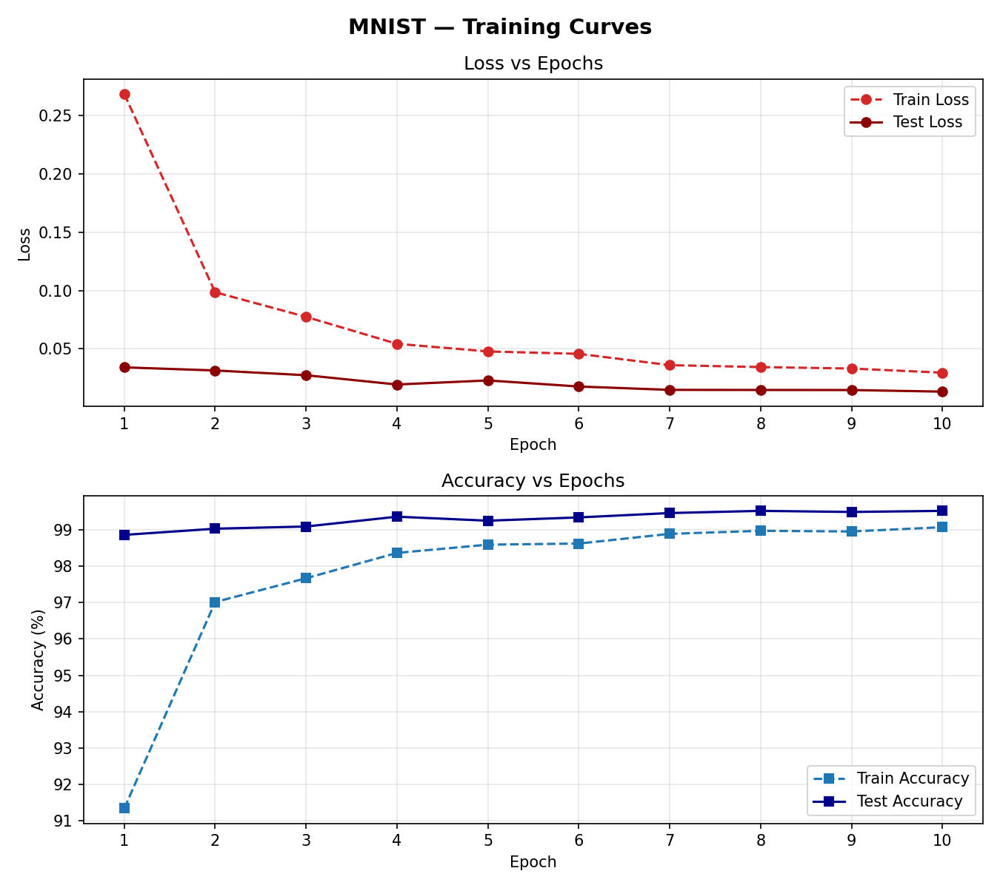
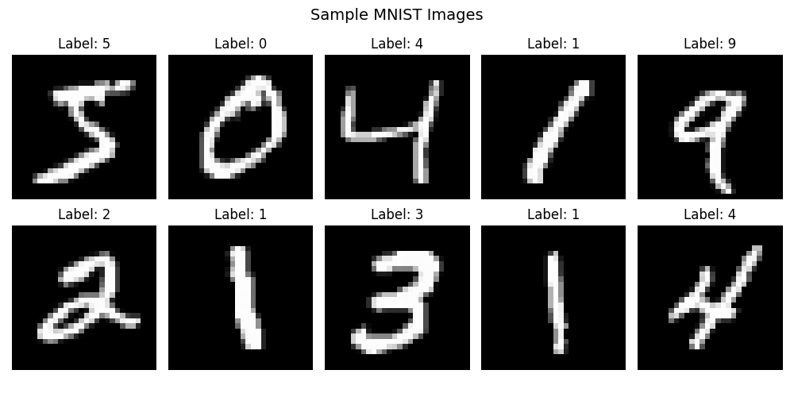
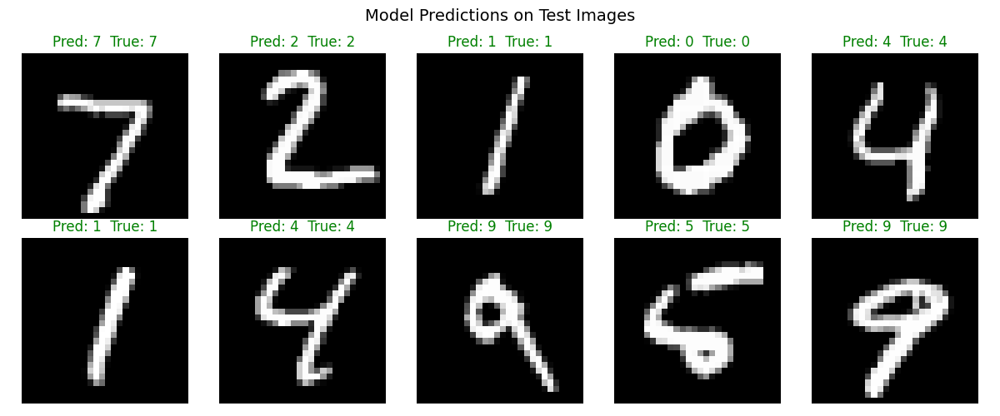
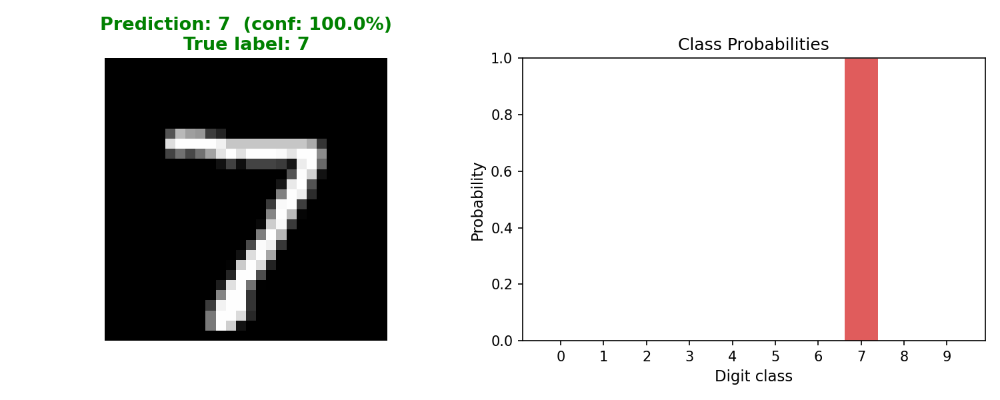
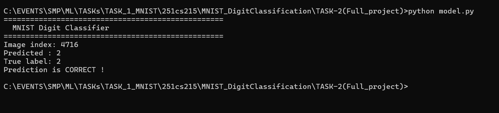

# MNIST Digit Classifier : CNN with PyTorch

A Convolutional Neural Network (CNN) built from scratch using PyTorch to classify handwritten digits (0-9) from the MNIST dataset. Achieves **~99.5% test accuracy** after 10 epochs of training.

---

## Project Structure

```
TASK-2(Full_project)/
|
|---> MNIST_Digit_classifier.py   # Main script : all 6 tasks in one file
|---> model.py                    # Inference script (loads weights to make predictions without retraining)
|---> mnist_cnn_weights.pt        # Saved model weights (state dict)
|
|--->Output/
|        | 
|        |---> sample_images.png           # Sample MNIST images from the dataset
|        |---> training_curves.png         # Loss & accuracy curves across epochs
|        |---> predictions_grid.png        # Grid of 10 model predictions
|        |---> inference_single.png        # Single image prediction with probability chart
|
|---> data/                                 # Auto-downloaded MNIST dataset
```

---

## Demo

>A demo video is included showing the full training output and inference results in action.

https://drive.google.com/file/d/1Cr0N8E2OefjU_LKOd-HRgmdjeQzIx7zz/view?usp=sharing

---

## Model Architecture

```
Input (1 × 28 × 28)
  --> Conv2d(1, 32, 3×3) --> ReLU --> MaxPool  -->  14×14
  --> Conv2d(32, 64, 3×3) --> ReLU --> MaxPool  -->  7×7
  --> Conv2d(64, 64, 3×3) --> ReLU  -->  7×7
  --> Flatten --> 3136
  --> Linear(3136, 128) --> ReLU --> Dropout(0.25)
  --> Linear(128, 10)
```

Each convolutional layer learns increasingly complex features, the first one picks up basic edges and curves, the second recognizes shapes, and the third starts to understand digit-level patterns. The two fully connected layers at the end take all those features and map them to one of the 10 digit classes.

Dropout (p=0.25) is applied after the first FC layer to randomly turn off some neurons during training, which stops the model from memorizing the training data.

**Total trainable parameters: ~458,570**

---

## Training Setup

| Hyperparameter | Value |
|----------------|-------|
| Loss function | CrossEntropyLoss |
| Optimizer | Adam (lr = 0.001) |
| LR Scheduler | StepLR (step=3, gamma=0.5) |
| Epochs | 10 |
| Batch size | 64 |

## Data Pipeline

The dataset has 60,000 training images and 10,000 test images, all 28×28 grayscale.

Images are normalized using the known MNIST mean (0.1307) and standard deviation (0.3081), which scales pixel values to a range the model can learn from more efficiently.

**Data augmentation** is applied only to the training set:

- `RandomRotation(10 degrees)` : slightly tilts the digit to simulate real handwriting .
- `RandomAffine` : small random shifts (up to 10%) and zoom (10%) to simulate digits not always being centered .

The test set gets no augmentation at all , just the normalization. This is important because the accuracy number should reflect how the model performs on real images.

---

## Results

**Best Test Accuracy: ~99.5%**

### Training Curves


> Top: Loss decreasing over epochs. Bottom: Accuracy increasing over epochs.

The training and test accuracy curves both climb steeply in the first 2-3 epochs, which is where the model learns the most. After that the improvement slows down and both curves start to level off around epochs 7-10.

One thing to notice is that the train accuracy is  slightly lower than the test accuracy . This happens because augmentation makes the training images harder (slightly rotated, shifted), while the test images are clean , so the test set is actually easier for the model at that stage.

By the end, both curves converge closely together, which is a good sign , it means the model is generalizing well and not overfitting to the training data.

A learning rate scheduler halves the learning rate every 3 epochs (`StepLR, gamma=0.5`). This is what helps push accuracy past 99%, the model learns very fast early on and then decreases its learning speed  later.

---

## Sample Dataset Images



10 sample images from the MNIST training set with their true labels.

---

## Model Predictions

### Grid View (10 images)


Green title = correct prediction. Red title = wrong prediction.

### Single Image with Probability Chart


Left: the digit image. Right: probability distribution across all 10 digit classes. The red bar is the predicted class.

---

## How to Run

**Install dependencies:**
```bash
pip install torch torchvision matplotlib
```

**Train the model:**
```bash
python MNIST_Digit_classifier.py
```

This will:
1. Download the MNIST dataset automatically
2. Train for 10 epochs
3. Save weights to `mnist_cnn_weights.pt`
4. Generate all output images

**Use the saved model (no retraining):**
```bash
python model.py
```

A random digit predicted by the model

---

## What I Tried : Gaussian Blur Experiment

I experimented with adding **Gaussian Blur** as a data augmentation step during training:

```python
transforms.GaussianBlur(kernel_size=3, sigma=(0.1, 0.5))
```

It actually hurt performance, accuracy dropped from ~99.5% down to around **95%**.

This is beacuse Gaussian blur softens an image by averaging neighboring pixels, which washes out sharp edges. For digit recognition, edges are very important , they are what separates a `1` from a `7`. The model learns to rely heavily on those edges.

Another problem was the train-test mismatch. Blur was only applied to training images (as it should be for augmentation), but the test images remained clean and sharp. So the model trained on soft blurry digits but was then tested on clear ones , two different data sets. The model just wasn't prepared for what it saw at test time, which is exactly what caused the accuracy drop.

The lesson: augmentation should simulate realistic variations that could appear at test time. Blur doesn't fit that , real handwritten digits on paper aren't blurry, so there's no reason to train on blurry ones.

---

---

## Reflection

**What I'd change about the architecture:**
- Add **Batch Normalisation** after each conv layer to stabilise training and allow higher learning rates
- Use a **learning rate finder** instead of manually setting lr=0.001 for better convergence.

**What would improve accuracy further:**
- Elastic distortion augmentation .
- Ensemble multiple models i.e., to train multiple models and average their predictions , this reduces error and makes sure that one bad model doesn't ruin the answer.
- Train for more epochs with a lower final learning rate.
